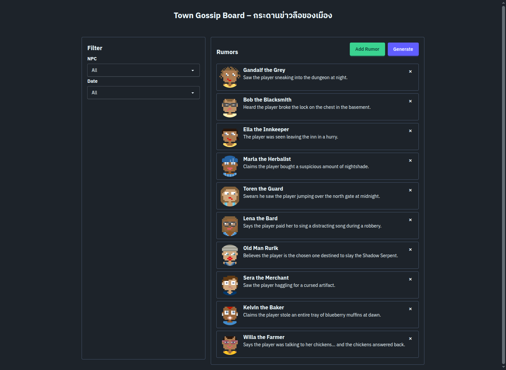

# Town Gossip Board By Ripple

A system where NPCs gather, post, and vote on rumors about players. Each rumor can be tagged to quests, tracked over time, and verified by other NPCs.

<div align="center">



</div>

### **แนวคิดหลัก**

- โลก RPG ส่วนใหญ่ผู้เล่นจะเห็น NPC เป็นแค่ quest giver หรือ merchant แต่ **ในมุมมอง NPC** ผู้เล่นคือตัวละครที่สร้างข่าวลือและเรื่องราวให้เมือง
- NPC แต่ละตัวสามารถ **post, vote, comment, หรือ verify** ข่าวลือเกี่ยวกับผู้เล่น
- ระบบนี้ไม่ใช่เกมจริง ๆ แต่เป็น **simulation/dashboard** ให้ลองเทส framework ทั้ง CRUD, real-time updates, และ user interaction

---

## Getting Started

1. Install dependencies:

    ```bash
    npm install # or pnpm or yarn
    ```

2. Start the development server:

    ```bash
    npm run dev
    ```

3. Build for production:
    ```bash
    npm run build
    ```

## Code Formatting

This template includes Prettier with the Ripple plugin for consistent code formatting.

### Available Commands

- `npm run format` - Format all files
- `npm run format:check` - Check if files are formatted correctly

### Configuration

Prettier is configured in `.prettierrc` with the following settings:

- Uses tabs for indentation
- Single quotes for strings
- 100 character line width
- Includes the `@ripple-ts/prettier-plugin` for `.ripple` file formatting

### VS Code Integration

For the best development experience, install the [Prettier VS Code extension](https://marketplace.visualstudio.com/items?itemName=esbenp.prettier-vscode) and the [Ripple VS Code extension](https://marketplace.visualstudio.com/items?itemName=ripple-ts.vscode-plugin).

## Learn More

- [Ripple Documentation](https://github.com/Ripple-TS/ripple)
- [Vite Documentation](https://vitejs.dev/)

## Idea

### **UI คร่าว ๆ**

1. **Timeline ของข่าวลือ**
    - List ของข่าวลือเรียงตามเวลา (ใหม่ → เก่า)
    - แต่ละข่าวประกอบด้วย:
        - 🧙‍♂️ **NPC ที่โพสต์**
        - 📝 **ข้อความข่าวลือ** (เช่น “เห็นผู้เล่นลอบเข้า dungeon ตอนกลางคืน”)
        - 🏷 **Tags/Quest associations** (เช่น “quest:DragonSlayer”)
        - 👍👎 **Vote ว่าจริงหรือโกหก**
        - ⏰ Timestamp

2. **Sidebar / Filter**
    - Filter ข่าวลือตาม:
        - NPC ที่โพสต์
        - Tag ของ quest
        - ความจริง/โกหก (Vote)

3. **โพสต์ข่าวลือใหม่ (สำหรับ NPC)**
    - Text input
    - Dropdown เลือก tag ของ quest
    - Submit → ปรากฏบน timeline

4. **Vote / Verify**
    - NPC อื่น ๆ สามารถ vote ว่าจริงหรือโกหก
    - Vote rate จะเปลี่ยนสี/ไอคอน:
        - ✅ มากกว่า 50% vote จริง
        - ❌ มากกว่า 50% vote โกหก
        - ⚖️ ยังไม่ชัดเจน

5. **Optional: Interaction Graph**
    - แสดงกราฟสรุปว่าผู้เล่นคนนี้มีข่าวลือกี่เรื่องเกี่ยวข้องกับ NPC ไหนบ้าง
    - แสดงความเชื่อมโยง quest และ NPC
